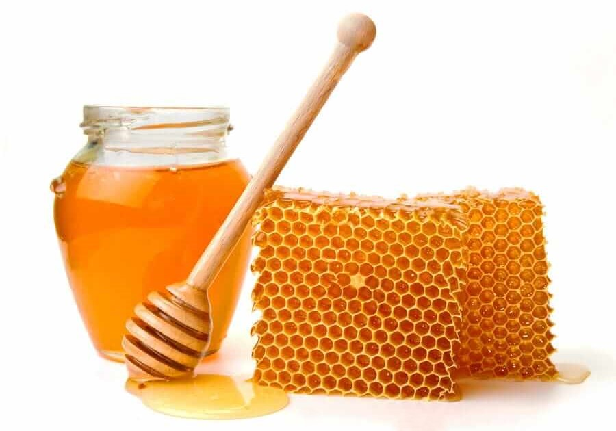

# Recepten

Dit is mijn website met recepten en informatie over mijn honingbijen.
Als je meer informatie wil ben ik bereikbaar op info @ pimker.nl

* * *

## Honing

**Honing uit eigen tuin**

* * *

## Bramenjam

**recept voor bramenjam**

#### ingrediënten

* 1.3 kg bramen
* 1 citroen
* 500 g geleisuiker speciaal
* 1 vanillestokje

#### Bereidingswijze

1. Halveer de grote bramen. Pers de citroen uit. Doe de bramen met de suiker en het citroensap in een pan met dikke bodem. Breng al roerend aan de kook op middelhoog vuur. Laat 3 min. flink doorkoken. Pas op voor spetters – houd kinderen uit de buurt van de pan. Verwijder schuim dat komt bovendrijven met een schuimspaan.

2. Snijd ondertussen het vanillestokje open en schraap met een mespunt het merg eruit. Voeg het merg toe aan de kokende bramen en roer door.

3. Vul de potten met een soeplepel met de hete jam tot de rand en sluit direct af. Zet de potten op hun kop. De lucht wordt zo uit de pot gedrukt, waardoor de jam langer houdbaar blijft.

Algemeen: Met 1,25 kg bramen maak je ca. 1,25 liter jam.
Dieettip: De voedingswaarden voor dit recept zijn berekend per eetlepel jam.
Bewaartip: Bewaar het overgebleven vanillestokje in een pot met suiker voor zelfgemaakte vanillesuiker

* * *

## Lemoncurd

**recept voor lemoncurd**

#### ingrediënten

* 2 citroenen
* 150 g ongezouten roomboter
* 2 middelgrote eieren
* 125 g witte basterdsuiker

#### Bereidingswijze

1. Pers de citroenen uit en verwarm het sap samen met de boter in een steelpan met dikke bodem op laag vuur tot de boter gesmolten is.

2. Mix ondertussen met een garde in een kom de eieren met de suiker. Voeg, al roerend, het citroen-botermengsel toe. Schenk het weer terug in de schoongemaakte pan. Breng al roerend op laag vuur aan de kook. Blijf roeren en laat de curd indikken tot het zo dik als vla is.

3. Schenk de lemon curd in een schone pot.

Combinatietip: Lekker bij de scones.
Bewaartip: Je kunt de lemon curd van tevoren bereiden en een week bewaren in de koelkast. Laat wel eerst goed afkoelen.

* * *

## Vlierbloesem siroop

**Vlierbloesemsiroop maken**

#### Ingrediënten

* Tussen de 7-10 vlierbloesemschermen (een flinke pan vol)
* Water
* 1200 gram suiker per liter
* 1 á 2 citroenen, gewassen en in plakken gesneden

#### Benodigdheden

* Een grote pan
* Genoeg schone flessen om de siroop in te bewaren
* Fijne zeef of kaasdoek
* Eventueel een kaasdoek/schone theedoek

#### Bereidingswijze

1. Pluk de vlierbloesem op een schone plek en schud de schermen uit om eventuele beestjes te verwijderen. Let op: was de schermen niet, daarmee was je veel van de smaak weg.

2. Haal zoveel mogelijk van de stengels weg, deze kunnen een bittere smaak geven. Doe de bloesems samen met de citroen in een pan en zorg dat de vlierbloesems nét onder water staan.

3. Laat dit 1 tot 2 dagen staan zodat de smaak in het water kan trekken.

4. Giet alles door een zeef zodat je alleen het vocht overhoud. Je kunt eventueel een kaasdoek of een schone theedoek in je zeef of vergiet leggen om extra te secuur te zeven. Zo houd je alle onzuiverheden uit je siroop.

5. Knijp de citroenschijfjes uit.

6. Meet hoeveel vocht je hebt en doe dat samen met 1200 gram suiker per liter in een grote pan. Verhit dit (het hoeft niet te koken) totdat de suiker opgelost is.

Doe de siroop heet in je schone flessen, en zet deze op een koele, donkere plek.
De siroop is lang houdbaar. Mocht je je fles siroop van vorig jaar toch per ongeluk zijn vergeten dan kun je aan de geur merken of toch niet goed meer is. Maar het is zo lekker dat het waarschijnlijk niet zover zal komen!

* * *
